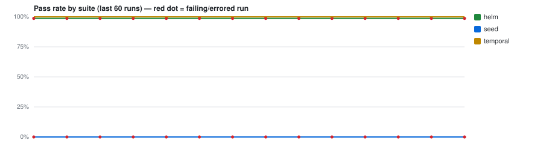

# CI test trends — `Thabekhulu2/Resume`

> Auto-generated by **PR Validation** (`publish-test-history`). Do not edit by hand — every
> run regenerates this branch. The machine-readable source of truth is [`runs.jsonl`](./runs.jsonl).
> Deployed-environment E2E trends live separately on the [`e2e-history`](../../tree/e2e-history) branch.

**Last updated:** 2026-08-26 08:42Z · 11 records · suites: `helm`, `seed`, `temporal`



## Suites

| Suite | Latest | When (UTC) | Pass 24h | Pass 7d | Green streak | Runs |
|---|---|---|--:|--:|--:|--:|
| `helm` | ❌ `failed` [↗](https://github.com/Thabekhulu2/Resume/actions/runs/32949086855) | — | — | — | 0 | 4 |
| `seed` | ❌ `failed` [↗](https://github.com/Thabekhulu2/Resume/actions/runs/32949086855) | — | — | — | 0 | 4 |
| `temporal` | ✅ `passed` [↗](https://github.com/Thabekhulu2/Resume/actions/runs/32949086855) | 2026-08-26 08:42Z | 100% (3) | 100% (3) | 3 | 3 |


## Recent runs

| When (UTC) | Suite | Result | Pass | Fail | Skip | Duration | Commit | Run |
|---|---|---|--:|--:|--:|--:|---|---|
| 2026-08-26 08:42Z | `temporal` | ✅ passed | 19 | 0 | 0 | 1.9s | `1ac7bae` | [#4](https://github.com/Thabekhulu2/Resume/actions/runs/32949086855) |
| 2026-08-26 08:34Z | `temporal` | ✅ passed | 19 | 0 | 0 | 2.2s | `275b49b` | [#3](https://github.com/Thabekhulu2/Resume/actions/runs/32948385747) |
| 2026-08-26 07:46Z | `temporal` | ✅ passed | 19 | 0 | 0 | 2.1s | `91837bd` | [#2](https://github.com/Thabekhulu2/Resume/actions/runs/32944329314) |
| — | `seed` | ❌ failed | 0 | 1 | 0 | — | `1ac7bae` | [#4](https://github.com/Thabekhulu2/Resume/actions/runs/32949086855) |
| — | `helm` | ❌ failed | 151 | 2 | 0 | — | `1ac7bae` | [#4](https://github.com/Thabekhulu2/Resume/actions/runs/32949086855) |
| — | `seed` | ❌ failed | 0 | 1 | 0 | — | `275b49b` | [#3](https://github.com/Thabekhulu2/Resume/actions/runs/32948385747) |
| — | `helm` | ❌ failed | 151 | 2 | 0 | — | `275b49b` | [#3](https://github.com/Thabekhulu2/Resume/actions/runs/32948385747) |
| — | `seed` | ❌ failed | 0 | 1 | 0 | — | `91837bd` | [#2](https://github.com/Thabekhulu2/Resume/actions/runs/32944329314) |
| — | `helm` | ❌ failed | 151 | 2 | 0 | — | `91837bd` | [#2](https://github.com/Thabekhulu2/Resume/actions/runs/32944329314) |
| — | `seed` | ❌ failed | 0 | 1 | 0 | — | `70245c3` | [#1](https://github.com/Thabekhulu2/Resume/actions/runs/32886112095) |
| — | `helm` | ❌ failed | 151 | 2 | 0 | — | `70245c3` | [#1](https://github.com/Thabekhulu2/Resume/actions/runs/32886112095) |


## Unstable tests (recent window)

_No failing or flaky tests in the recent window. 🎉_


---

### Reading this data programmatically

```bash
# every line is one suite-run; newest last
git show ci-history:runs.jsonl | tail -n 20

# e.g. the unit suite's pass-rate over its last 50 runs
git show ci-history:runs.jsonl \
  | jq -rs '[.[] | select(.suite=="unit")] | .[-50:]
            | (map(select(.outcome=="passed")) | length) / length * 100'
```

Record shape: `{ ts, suite, outcome, pass_rate, stats:{expected,unexpected,flaky,skipped,total,duration_ms}, run_url, sha_short, branch, trigger, tests:[{title,file,status,duration_ms}] }`
